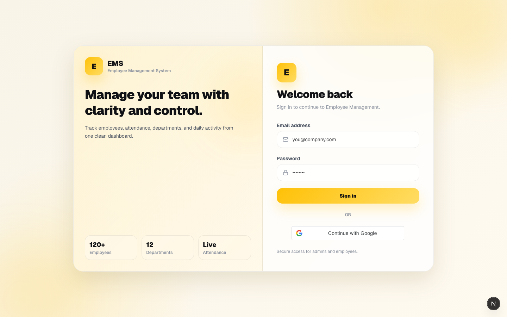
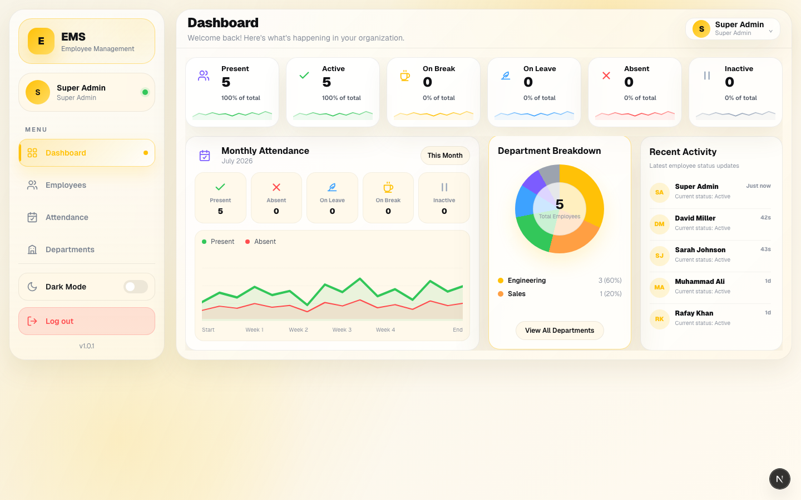
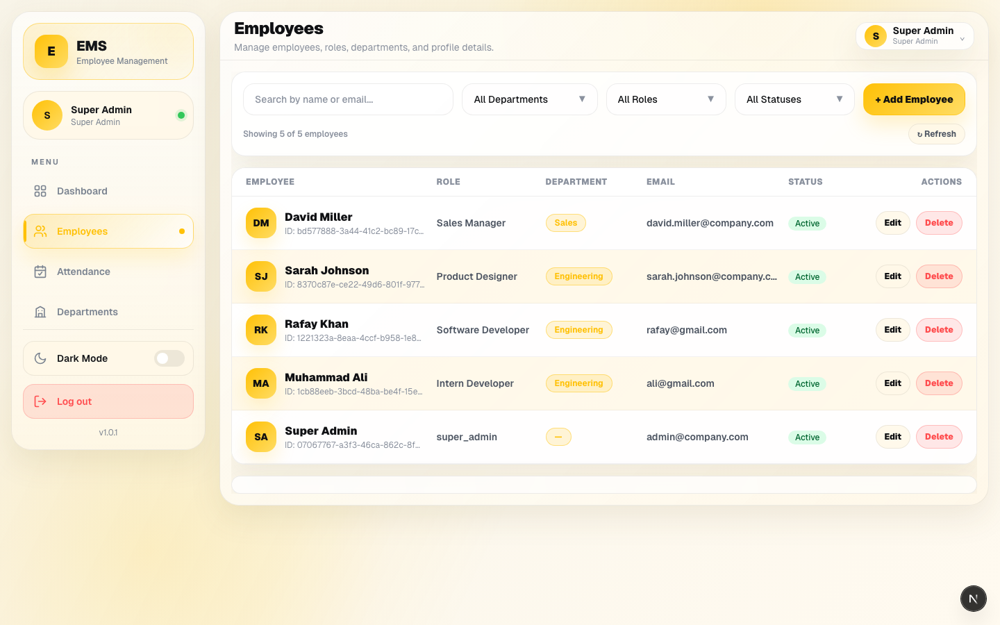
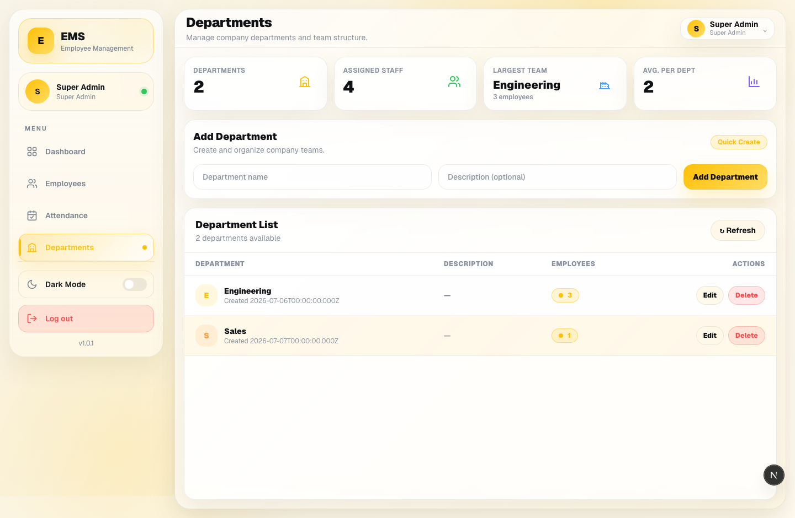
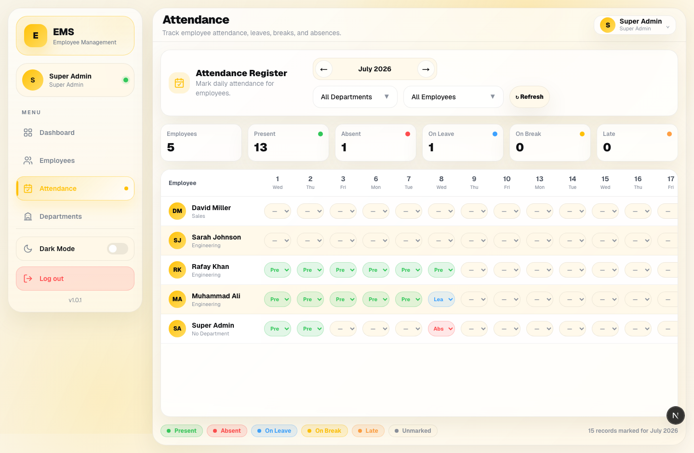
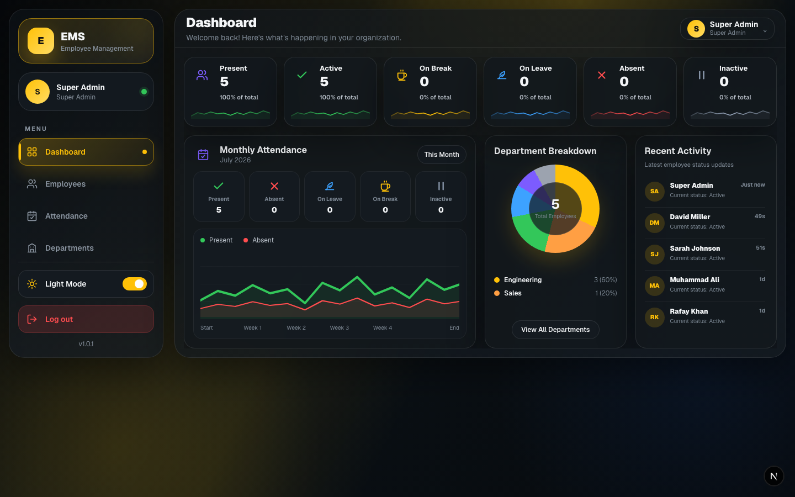

<div align="center">

# 🧑‍💼 Employee Management System

**A modern, full-stack platform to manage employees, departments, and daily attendance — in one clean dashboard.**

[](https://nextjs.org)
[](https://react.dev)
[](https://www.typescriptlang.org)
[](https://expressjs.com)
[](https://www.postgresql.org)
[](https://tailwindcss.com)

</div>

---

## ✨ Demo

<p align="center">
  
</p>

<p align="center"><em>Sign in → live dashboard → employee directory → departments → attendance register → dark mode, all in one flow.</em></p>

> 🎥 Prefer full quality? Watch the [MP4 version](docs/video/demo.mp4).

---

## 🖼️ Screenshots

| Login | Dashboard |
|:---:|:---:|
|  |  |

| Employees | Departments |
|:---:|:---:|
|  |  |

| Attendance Register | Dark Mode |
|:---:|:---:|
|  |  |

---

## 🚀 Features

- 🔐 **Secure authentication** — email/password login with JWT access + refresh tokens, plus **Google Sign-In**
- 📊 **Live dashboard** — headcount, attendance trends, department breakdown, and a real-time activity feed
- 👥 **Employee directory** — search, filter by department/role/status, and manage full profiles
- 🏢 **Department management** — create, edit, and track team sizes at a glance
- 📅 **Attendance register** — mark present/absent/leave/break per employee, per day, with a full monthly view
- 🌗 **Light & dark mode** — theme choice is remembered across visits
- ⚡ **Modern stack** — Next.js App Router, TypeScript end-to-end, Tailwind CSS, Sequelize ORM over PostgreSQL

---

## 🧱 Tech Stack

| Layer | Technology |
|---|---|
| **Frontend** | Next.js 16, React 19, TypeScript, Tailwind CSS 4 |
| **Backend** | Node.js, Express 4, TypeScript |
| **Database** | PostgreSQL via Sequelize ORM |
| **Auth** | JWT (access + refresh), bcrypt, Google OAuth |
| **Testing** | Jest, React Testing Library, Playwright (E2E) |

---

## 🏗️ Architecture

This is a monorepo with three layers:

```
┌─────────────┐        ┌──────────────┐        ┌──────────────┐
│  FrontEnd    │  HTTP  │   BackEnd     │  SQL   │  PostgreSQL   │
│  Next.js     │ ─────► │  Express API  │ ─────► │  (Sequelize)  │
│  :3000       │ ◄───── │  :4000        │ ◄───── │               │
└─────────────┘        └──────────────┘        └──────────────┘
```

- **FrontEnd** (`/FrontEnd`) — the Next.js app users interact with.
- **BackEnd** (`/BackEnd`) — the Express API that validates requests and talks to the database.
- **Database** — PostgreSQL, modeled with Sequelize (`Employee`, `Department`, `Attendance`).

Want the full request-by-request walkthrough (e.g. what happens when you add an employee)? See [`docs/architecture.md`](#-how-it-works) below.

---

## ⚙️ Getting Started

### Prerequisites

- Node.js 18+
- A PostgreSQL database (local or hosted, e.g. [Neon](https://neon.tech))

### 1. Clone & install

```bash
git clone https://github.com/muhammadali-dotcom/Employee_Management.git
cd Employee_Management
npm run install-all
```

### 2. Configure environment variables

```bash
cp BackEnd/.env.example BackEnd/.env
cp FrontEnd/.env.example FrontEnd/.env.local
```

Fill in your PostgreSQL credentials, JWT secrets, and (optionally) Google OAuth client ID in `BackEnd/.env`. Make sure `CLIENT_URL` in `BackEnd/.env` matches the port your frontend runs on (`http://localhost:3000` by default).

### 3. Create your first admin account

```bash
cd BackEnd
npx ts-node src/scripts/createSuperAdmin.ts
```

### 4. Run the app

From the project root:

```bash
npm run dev
```

- Frontend → [http://localhost:3000](http://localhost:3000)
- Backend API → [http://localhost:4000](http://localhost:4000)

Log in at `/login` with the super admin credentials printed by the setup script.

---

## 🧪 Testing

```bash
# Frontend unit tests (Jest)
npm run test --prefix FrontEnd

# Frontend E2E tests (Playwright)
npm run test:e2e --prefix FrontEnd

# Backend tests
npm run test --prefix BackEnd
```

---

## 📖 How It Works

<details>
<summary><strong>Click to expand a beginner-friendly deep dive into the data flow</strong></summary>

### 1. High-Level Architecture

The project uses a monorepo layout split into three layers:

- **Database (PostgreSQL)** — stores employees, departments, and attendance logs.
- **BackEnd (Express + Node.js)** — runs on port `4000`. Validates requests, talks to the database, returns JSON.
- **FrontEnd (Next.js + React + Tailwind CSS)** — runs on port `3000`. The site users interact with.

### 2. How Everything Boots Up

The root `package.json` uses `concurrently` to launch both servers together via `npm run dev`.

### 3. Example: Loading the Dashboard

- **Database schema** — Sequelize models live in `BackEnd/src/models` (e.g. `Employee.ts` defines fields like `firstName`, `email`, `status`, and its relationship to `Department`).
- **Backend routes** — `BackEnd/src/index.ts` mounts `app.use('/api/employees', employeeRoutes)`. `routes/employees.ts` wires `GET /` to `getAllEmployees`, which asks Sequelize for `Employee.findAll({ include: [Department] })` and responds with JSON.
- **Frontend fetch** — `FrontEnd/lib/store.ts` exposes `getEmployees()`, called from `app/dashboard/page.tsx` inside a `useEffect`. The result is stored in React state and rendered as stat cards, charts, and lists.

### 4. Example: Adding a New Employee

1. You submit the **Add Employee** form.
2. `saveEmployee()` in `lib/store.ts` sends a `POST` to `/api/employees`.
3. Backend `validateEmployee` middleware checks the payload (non-empty names, valid email).
4. `createEmployee()` in `controllers/employeeController.ts` runs `Employee.create(req.body)`.
5. Sequelize issues an `INSERT`; duplicate emails are rejected gracefully.
6. On success (`201 Created`), the frontend redirects to the table and shows the new employee immediately.

### 5. Other Utilities

- **Dark mode** — `ThemeContext.tsx` tracks the user's preference in `localStorage` and toggles a CSS class on the root layout.
- **Schema sync** — `BackEnd/src/index.ts` calls `sequelize.sync({ alter: true })` on startup so local schema changes apply automatically (development convenience, not a migration tool).

</details>

---

## 📄 License

This project is provided as-is for learning and internal use.

<div align="center">

Made with ☕ and TypeScript

</div>
